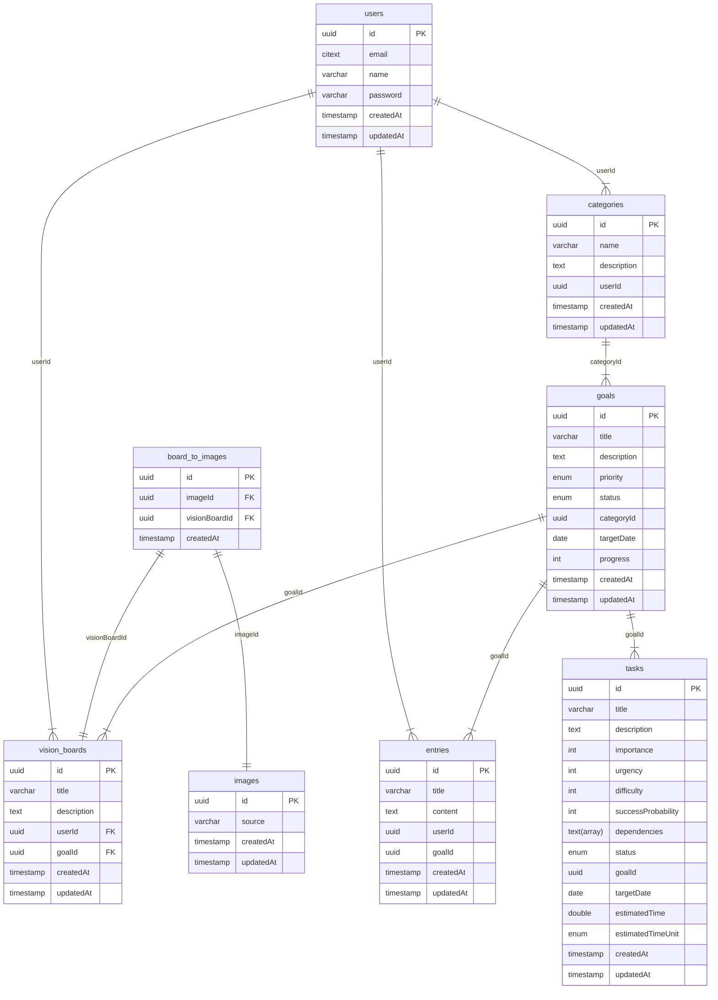

# BetterSelf

## Database Schema

```mermaid
erDiagram
   users {
      uuid id PK
      citext email
      varchar name
      varchar password
      timestamp createdAt
      timestamp updatedAt
   }

   categories {
      uuid id PK
      varchar name
      text description
      uuid userId
      timestamp createdAt
      timestamp updatedAt
   }

   goals {
      uuid id PK
      varchar title
      text description
      enum priority
      enum status
      uuid categoryId
      date targetDate
      int progress
      timestamp createdAt
      timestamp updatedAt
   }

   tasks {
      uuid id PK
      varchar title
      text description
      int importance
      int urgency
      int difficulty
      int successProbability
      text(array) dependencies
      enum status
      uuid goalId
      date targetDate
      double estimatedTime
      enum estimatedTimeUnit
      timestamp createdAt
      timestamp updatedAt
   }

   entries {
      uuid id PK
      varchar title
      text content
      uuid userId
      uuid goalId
      timestamp createdAt
      timestamp updatedAt
   }

   images {
        uuid id PK
        varchar source
        timestamp createdAt
        timestamp updatedAt
   }

   vision_boards {
        uuid id PK
        varchar title
        text description
        uuid userId FK
        uuid goalId FK
        timestamp createdAt
        timestamp updatedAt
   }

   board_to_images {
        uuid id PK
        uuid imageId FK
        uuid visionBoardId FK
        timestamp createdAt
   }

   users ||--|{ categories : userId
   users ||--|{ entries : userId
   users ||--|{ vision_boards : userId
   categories ||--|{ goals : categoryId
   board_to_images ||--|| images : imageId
   board_to_images ||--|| vision_boards : visionBoardId
   goals ||--|{ tasks : goalId
   goals ||--|{ vision_boards : goalId
   goals ||--|{ entries : goalId
```
