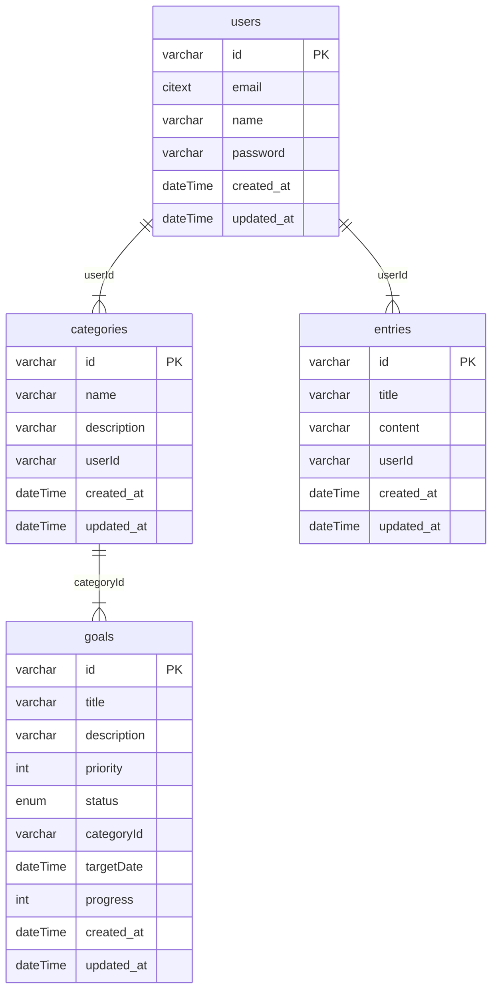

# BetterSelf

## Database Schema

```mermaid
erDiagram
   users {
      varchar id PK
      citext email
      varchar name
      varchar password
      dateTime created_at
      dateTime updated_at
   }

   categories {
      varchar id PK
      varchar name
      varchar description
      varchar userId
      dateTime created_at
      dateTime updated_at
   }
   
   goals {
      varchar id PK
      varchar title
      varchar description
      int priority
      enum status
      varchar categoryId
      dateTime targetDate
      int progress
      dateTime created_at
      dateTime updated_at
   }

   entries {
      varchar id PK
      varchar title
      varchar content
      varchar userId
      dateTime created_at
      dateTime updated_at
   }

   users ||--|{ categories : userId
   users ||--|{ entries : userId
   categories ||--|{ goals : categoryId
```