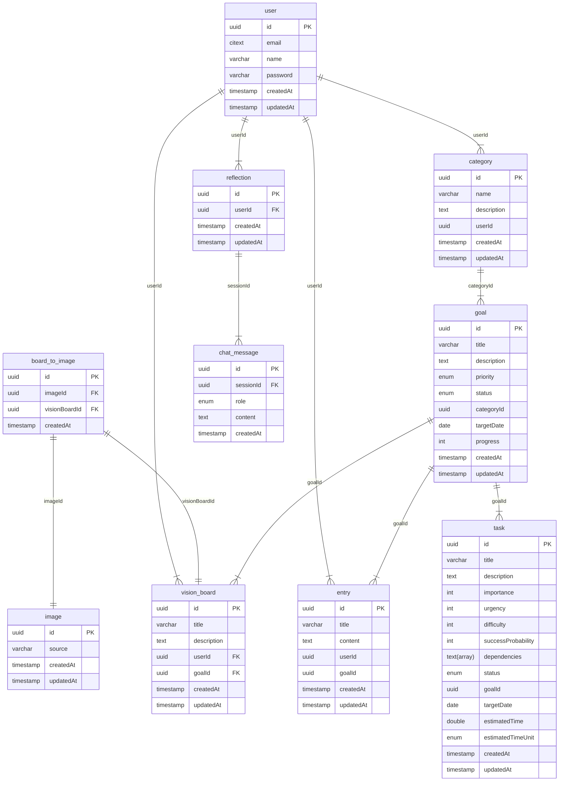

# BetterSelf

BetterSelf is a goal achievement web application designed to help users become the best version of themselves. It allows users to create and categorize personal goals, break them down into manageable tasks (including AI-generated tasks), and prioritize them using the TOPSIS decision-making method. The app also features a personal journal, a motivational vision board, and a self-reflection chat powered by AI. These tools are designed to support personal growth, maintain focus, and provide emotional and strategic support throughout the goal achievement process.
## Database Schema

