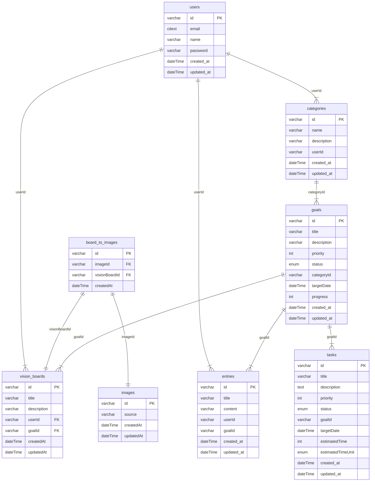

# BetterSelf

## Database Schema

```mermaid
erDiagram
   users {
      varchar id PK
      citext email
      varchar name
      varchar password
      dateTime created_at
      dateTime updated_at
   }

   categories {
      varchar id PK
      varchar name
      varchar description
      varchar userId
      dateTime created_at
      dateTime updated_at
   }

   goals {
      varchar id PK
      varchar title
      varchar description
      int priority
      enum status
      varchar categoryId
      dateTime targetDate
      int progress
      dateTime created_at
      dateTime updated_at
   }

   tasks {
      varchar id PK
      varchar title
      text description
      int priority
      enum status
      varchar goalId
      dateTime targetDate
      int estimatedTime
      enum estimatedTimeUnit
      dateTime created_at
      dateTime updated_at
   }

   entries {
      varchar id PK
      varchar title
      varchar content
      varchar userId
      varchar goalId
      dateTime created_at
      dateTime updated_at
   }

   images {
        varchar id PK
        varchar source
        dateTime createdAt
        dateTime updatedAt
   }

   vision_boards {
        varchar id PK
        varchar title
        varchar description
        varchar userId FK
        varchar goalId FK
        dateTime createdAt
        dateTime updatedAt
   }

   board_to_images {
        varchar id PK
        varchar imageId FK
        varchar visionBoardId FK
        dateTime createdAt
   }

   users ||--|{ categories : userId
   users ||--|{ entries : userId
   users ||--|{ vision_boards : userId
   categories ||--|{ goals : categoryId
   board_to_images ||--|| images : imageId
   board_to_images ||--|| vision_boards : visionBoardId
   goals ||--|{ tasks : goalId
   goals ||--|{ vision_boards : goalId
   goals ||--|{ entries : goalId
```
